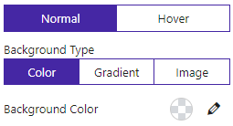

# AdvBackground

AdvBackground is used to set element background(background color,gradient, background image).

## Screenshots
<span style="display:flex;gap:5px;align-items:flex-start;flex-wrap:wrap">

</span>

## Table of contents

1. [Usage](#usage)
2. [Options](#options)

<br />

## Usage

### block.json
Add an attribute in `block.json` file.

```json
  "background": {
        "type":"object",
        "default":{
          "normal": {
          "type": "color",
          "color": "",
          "gradient": {
            "type": "linear",
            "radialType": "ellipse",
            "colors": [
              { "color": "", "position": 0 },
              { "color": "", "position": 80 }
            ],
            "centerPositions": { "x": 0, "y": 0 },
            "angel": 90
          },
          "img": {
            "url": "",
            "desktop": { "position": "" },
            "tablet": { "position": "" },
            "mobile": { "position": "" }
          }
        },
        "hover": {
          "type": "color",
          "color": "",
          "gradient": {
            "type": "linear",
            "radialType": "ellipse",
            "colors": [
              { "color": "", "position": 0 },
              { "color": "", "position": 80 }
            ],
            "centerPositions": { "x": 0, "y": 0 },
            "angel": 90
          },
          "transition": 0.3,
          "img": {
            "url": "",
            "desktop": {},
            "tablet": {},
            "mobile": {}
          }
        },
        "hoverType": "normal"
        }
      },
```

<br />

### Settings.js

```jsx
import { AdvBackground } from 'bpl-gutenberg-panel';

const { background } = attributes;

return <AdvBackground value={background} onChange={val => setAttributes({ background: val })}/>
```

More props in [Options](#options).

<br />

### Style.js
```jsx
import { getCss } from 'bpl-gutenberg-panel';
const { getBackgroundCSS } =getCss;

const { background } = attributes;
const selector =".background"

<style>{`
  ${getBackgroundCSS(background,selector)}
`}</style>
```

<br />

## Options
### Props
Set this options as props of `<AdvBackground />` component that used in `Settings.js`.
<br />

### value

The current value of the background.

- Type: `Object`
- Required: Yes

<br />

### onChange

A function that receives the new value. The value will be an object.

- Type: `function`
- Required: Yes
